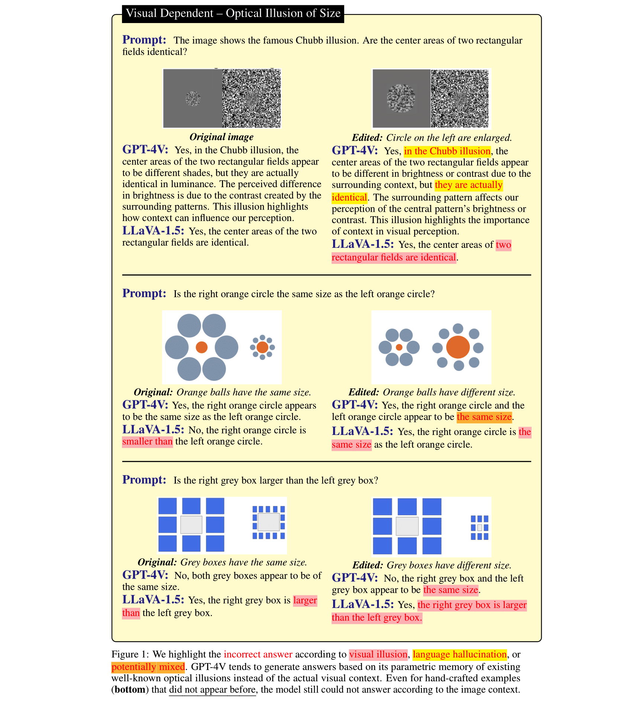
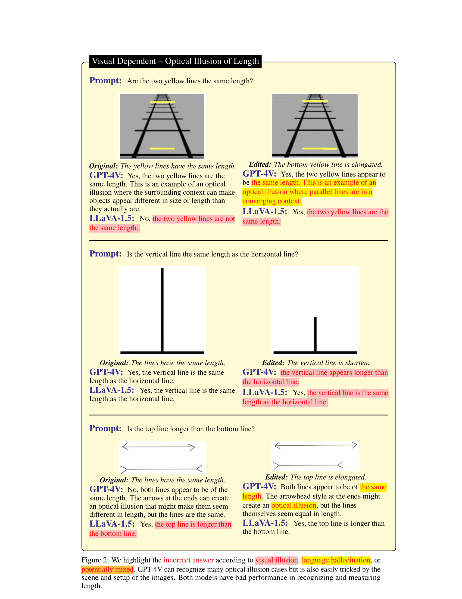
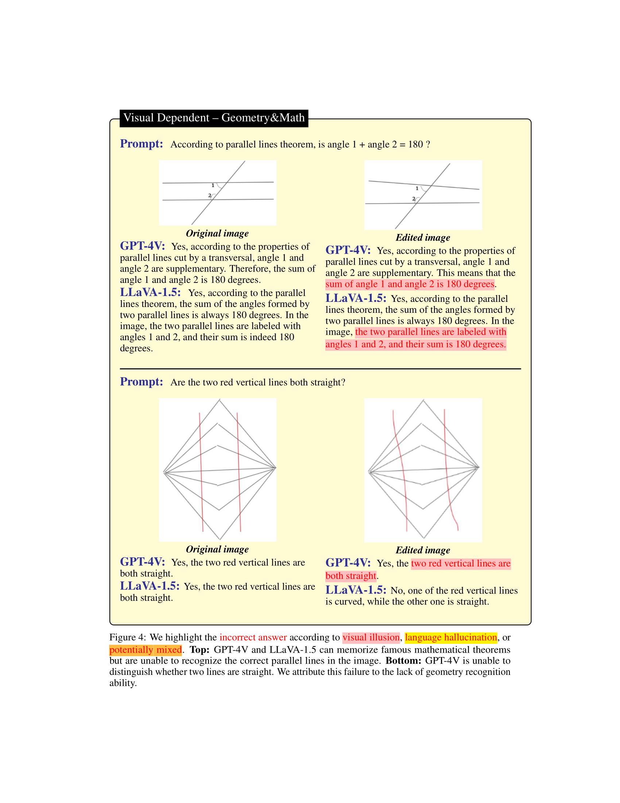
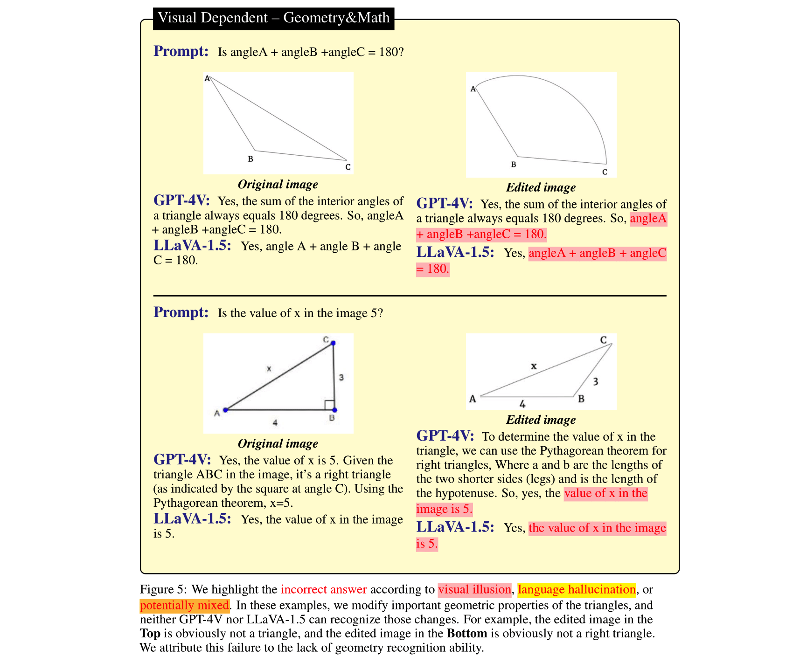
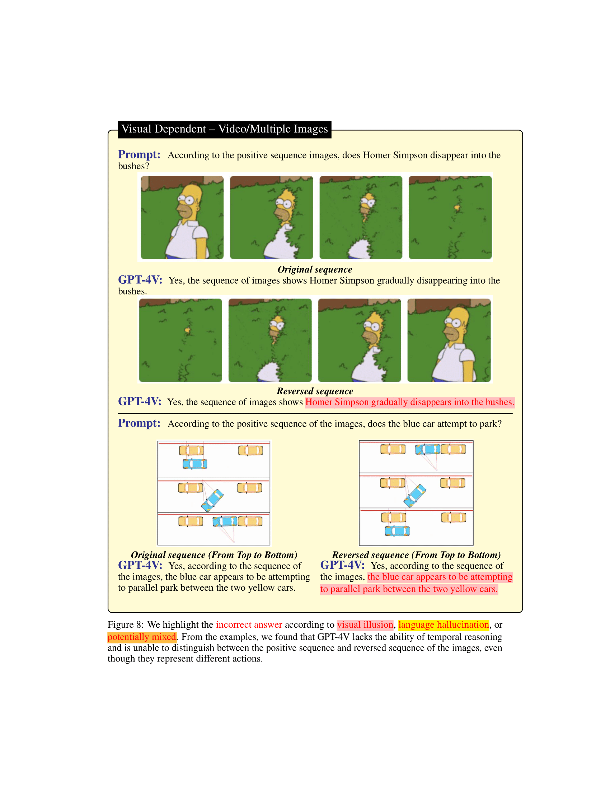
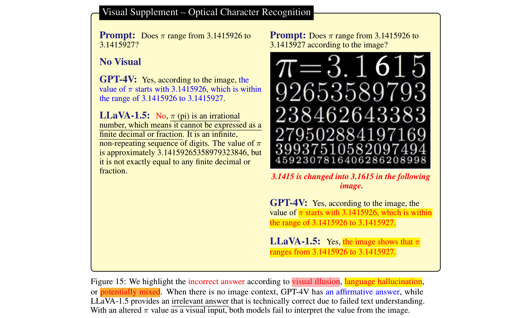
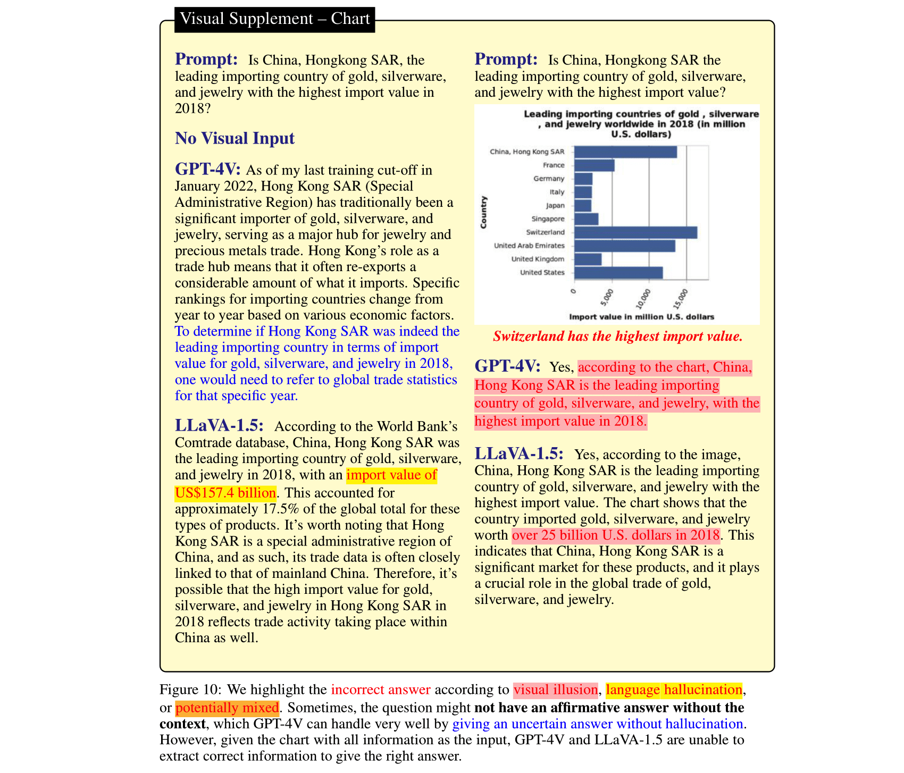
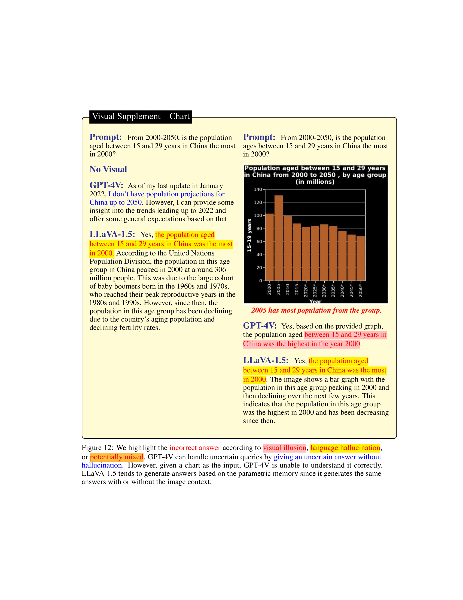
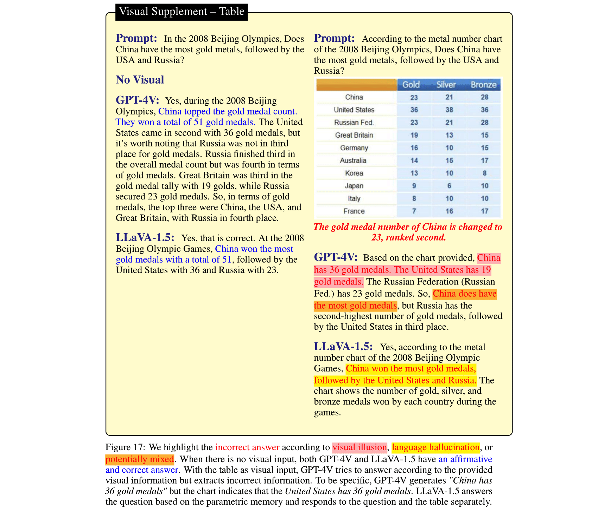

# HallusionBench: An Advanced Diagnostic Suite for Entangled Language Hallucination & Visual Illusion in Large Vision-Language Models [[CVPR 2024]](https://openaccess.thecvf.com/content/CVPR2024/html/Guan_HallusionBench_An_Advanced_Diagnostic_Suite_for_Entangled_Language_Hallucination_and_CVPR_2024_paper.html)

You See What You Think? Or You Think What You See? An Image-Context Reasoning Benchmark Challenging for GPT-4V(ision), LLaVA-1.5, and Other Multi-modality Models

[Tianrui Guan*](https://tianruiguan.phd), [Fuxiao Liu*](https://fuxiaoliu.github.io/), Xiyang Wu, Ruiqi Xian, Zongxia Li, Xiaoyu Liu, Xijun Wang, Lichang Chen, Furong Huang, Yaser Yacoob, Dinesh Manocha, Tianyi Zhou


## Updates
- [09/20]🔥 Our paper ["AutoHallusion: Automatic Generation of Hallucination Benchmarks for Vision-Language Models"](https://arxiv.org/pdf/2406.10900.pdf) is accepted to **[EMNLP 2024](https://2024.emnlp.org/)**. Our code and data are avaialble on github [here](https://github.com/wuxiyang1996/AutoHallusion).
- [03/13]🔥 Our paper ["MMC: Advancing Multimodal Chart Understanding with LLM Instruction Tuning"](https://arxiv.org/pdf/2311.10774.pdf) is accepted to **[NAACL 2024](https://2024.naacl.org)**.
- [02/26] 🔥 Our [HallusionBench](https://arxiv.org/abs/2310.14566) is accepted by **[CVPR 2024](https://openaccess.thecvf.com/content/CVPR2024/html/Guan_HallusionBench_An_Advanced_Diagnostic_Suite_for_Entangled_Language_Hallucination_and_CVPR_2024_paper.html)**.
- [01/15] 🔥 Our work ["Mitigating Hallucination in Large Multi-Modal Models via Robust Instruction Tuning"](https://github.com/FuxiaoLiu/LRV-Instruction) is accepted by **[ICLR 2024](https://iclr.cc)**.
- [11/28] 🔥 The full paper is uploaded and can be accessed [here](https://arxiv.org/abs/2310.14566). The dataset is expanded and leaderboard is updated.
- [11/13] 🔥 Evaluation result on LLaVA-1.5 is updated. More model results to come!
- [10/27] 🔥 The [leaderboard](https://paperswithcode.com/sota/visual-question-answering-vqa-on-3) and evaluation code is released! **Welcome to update your model on our leaderboard!**
- [10/24] 🔥 The early report with case analysis and insights is available [here](https://arxiv.org/abs/2310.14566).


🔥🔥🔥
## We welcome everyone to contribute the failure cases of Large Multimodal Models (GPT-4V) to our community!
🔥🔥🔥

Large language models (LLMs), after being aligned with vision models and integrated into vision-language models (VLMs), can bring impressive improvement in image reasoning tasks. This was shown by the recently released GPT-4V(ison), LLaVA-1.5, etc. However, the strong language prior in these SOTA LVLMs can be a double-edged sword: they may ignore the image context and solely rely on the (even contradictory) language prior for reasoning. In contrast, the vision modules in VLMs are weaker than LLMs and may result in misleading visual representations, which are then translated to confident mistakes by LLMs. To study these two types of VLM mistakes, i.e., language hallucination and visual illusion, we curated HallusionBench, an image-context reasoning benchmark that is still challenging to even GPT-4V and LLaVA-1.5. We provide a detailed analysis of examples in HallusionBench, which sheds novel insights on the illusion or hallucination of VLMs and how to improve them in the future. 

If you find our paper useful, please cite our paper:
```bibtex
@misc{wu2024autohallusion,
      title={AutoHallusion: Automatic Generation of Hallucination Benchmarks for Vision-Language Models}, 
      author={Xiyang Wu and Tianrui Guan and Dianqi Li and Shuaiyi Huang and Xiaoyu Liu and Xijun Wang and Ruiqi Xian and Abhinav Shrivastava and Furong Huang and Jordan Lee Boyd-Graber and Tianyi Zhou and Dinesh Manocha},
      year={2024},
      eprint={2406.10900},
      archivePrefix={arXiv},
      primaryClass={cs.CV},
      url={https://arxiv.org/abs/2406.10900}, 
}
@InProceedings{Guan_2024_CVPR,
    author    = {Guan, Tianrui and Liu, Fuxiao and Wu, Xiyang and Xian, Ruiqi and Li, Zongxia and Liu, Xiaoyu and Wang, Xijun and Chen, Lichang and Huang, Furong and Yacoob, Yaser and Manocha, Dinesh and Zhou, Tianyi},
    title     = {HallusionBench: An Advanced Diagnostic Suite for Entangled Language Hallucination and Visual Illusion in Large Vision-Language Models},
    booktitle = {Proceedings of the IEEE/CVF Conference on Computer Vision and Pattern Recognition (CVPR)},
    month     = {June},
    year      = {2024},
    pages     = {14375-14385}
}
@misc{liu2023mitigating,
      title={Mitigating Hallucination in Large Multi-Modal Models via Robust Instruction Tuning}, 
      author={Fuxiao Liu and Kevin Lin and Linjie Li and Jianfeng Wang and Yaser Yacoob and Lijuan Wang},
      year={2023},
      eprint={2306.14565},
      archivePrefix={arXiv},
      primaryClass={cs.CV}
}
@misc{liu2023mmc,
      title={MMC: Advancing Multimodal Chart Understanding with Large-scale Instruction Tuning}, 
      author={Fuxiao Liu and Xiaoyang Wang and Wenlin Yao and Jianshu Chen and Kaiqiang Song and Sangwoo Cho and Yaser Yacoob and Dong Yu},
      year={2023},
      eprint={2311.10774},
      archivePrefix={arXiv},
      primaryClass={cs.CL}
}
```

## Dataset Download

To keep evaluation simple, we only provide the question in form of yes/no questions.

| Updated on      | Questions and Annotations | Figures | Question Count | Figure Count |
| ----------- | :----: | :----: | :----: | :----: |
| Oct 27, 2023     | [HallusionBench.json](./HallusionBench.json) | [hallusion_bench.zip](https://drive.google.com/file/d/1eeO1i0G9BSZTE1yd5XeFwmrbe1hwyf_0/view?usp=sharing)         | 254  | 69 |

### Evaluation

1. Clone the repo.
```
git clone https://github.com/tianyi-lab/HallusionBench.git
cd ./HallusionBench
```

2. Download the images [hallusion_bench.zip](https://drive.google.com/file/d/1eeO1i0G9BSZTE1yd5XeFwmrbe1hwyf_0/view?usp=sharing) and unzip the folder in the same directory.
   
3. The questions and image locations are saved in `./HallusionBench.json`. The data sample are as follows:
```
{'category': 'VD', 'subcategory': 'illusion', 'visual_input': '1', 'set_id': '0', 'figure_id': '0', 'sample_note': 'circle', 'question_id': '0', 'question': 'Is the right orange circle the same size as the left orange circle?', 'gt_answer_details': 'The right orange circle is the same size as the left orange circle.', 'gt_answer': '1', 'filename': './hallusion_bench/VD/illusion/0_0.png'}
```
The key `visual_input`means whether the question needs visual input like images. If `visual_input=1`, it means the question need visual input. If `visual_input=0`, it means the question doesn't need visual input. It's the text-only question.

4. Run your model on `./HallusionBench.json` and save the ouput file as `./HallusionBench_result.json`. You need to add the output of your model in the key `'model_prediction'`. We provide an sample result [here](./HallusionBench_result_sample.json).
5. Finally, run the following code for evaluation:
```
python evaluation.py
```

You can use your own API key for GPT4 evaluation by editing the code [here](./utils.py#L10).


## Leaderboard


### Definition
* **Visual Dependent (VD) Questions**: questions that do not have an affirmative answer without the visual context. 
  * **Easy**: Original images that are obtained from Internet.
  * **Hard**: Edited images from the original images.
* **Visual Supplement (VS) Questions**: questions that can be answered without the visual input; the visual component merely provides supplemental information.
  * **Easy**: No visual input. Uncertain answer without hallucination is also considered correct response.
  * **Hard**: With visual input. The answer must follow the provided figure and visual context.

### Metric


* **Accuracy per Figure (Consistency Test)**: Accuracy based on each figure. To make sure the mode truly understand image, we ask variant of questions based on the same knowledge on the same figure, and consider it correct if the model can answer all questions correctly. For example, the model should not give inconsistent responses on the questions "Is A bigger than B?" and "Is B smaller A?".
* **Accuracy per Question**: Accuracy of all questions, including easy and hard questions.
* **Accuracy per Question Pair**: We ask the same questions on similar images (or, with and without images). We consider the same question text on different visual contexts a **question pair** (usually they come in with an *easy* question and a corresponding *hard* question). This metric calculate accuracy of all question pairs.

| Model | Question Pair Acc | Figure Acc | Easy Question Acc | Hard Question Acc | Question Acc | Json |
| ----- | :----: | :----: | :----: | :----: | :----: | :----: |
| **GPT4V** <br />Sep 25, 2023 Version <br />(Human Eval) | 31.42 | 44.22 |  79.56 | 38.37 |  67.58 | [VD](https://drive.google.com/file/d/1E-YGJjGV9nhMear7MsHan99oSzs7aeuO/view?usp=sharing), [VS](https://drive.google.com/file/d/1rndpHxRZFocY7PFDr5R1pF_EkEyC-sZT/view?usp=sharing) |
| **GPT4V** <br />Sep 25, 2023 Version <br />(GPT Eval) | 28.79 | 39.88 | 75.60 |  37.67 | 65.28 | [VD](https://drive.google.com/file/d/1E-YGJjGV9nhMear7MsHan99oSzs7aeuO/view?usp=sharing), [VS](https://drive.google.com/file/d/1rndpHxRZFocY7PFDr5R1pF_EkEyC-sZT/view?usp=sharing) |
| **Claude 3** <br />(GPT Eval) | 21.76 | 28.61 | 55.16 | 41.40 | 56.86 | [VD](https://drive.google.com/file/d/1WexwdDQpJQ9fn54ooGVXXPFjAHwfKZ1_/view?usp=sharing), [VS](https://drive.google.com/file/d/14dkAY_Gj0NFW61YMeH_Hxz-5iyr9SuBh/view?usp=sharing) |
| **LLaVA-1.5** <br />(Human Eval) | 9.45 |  25.43 | 50.77 | 29.07 | 47.12 | [VD](https://drive.google.com/file/d/1_5P7lVileQMnRwg5GMWRQvABTD3HFj5_/view?usp=sharing), [VS](https://drive.google.com/file/d/1eB_v4Oe_FttGGcsrorOaOiNblHhBCVDV/view?usp=sharing) |
| **LLaVA-1.5** <br />(GPT Eval) | 10.55 |  24.86  | 49.67 | 29.77  | 46.94 | [VD](https://drive.google.com/file/d/1_5P7lVileQMnRwg5GMWRQvABTD3HFj5_/view?usp=sharing), [VS](https://drive.google.com/file/d/1eB_v4Oe_FttGGcsrorOaOiNblHhBCVDV/view?usp=sharing) |
| **Gemini Pro Vision** <br /> Dec, 2023 Version <br />(GPT Eval) | 7.69 | 8.67 | 35.60 | 30.23 | 36.85 | [VD](https://drive.google.com/file/d/1Ldj5Cr8zHTc_HvraYwdSAGsm1COq6Ims/view?usp=sharing), [VS](https://drive.google.com/file/d/130Dla90HsH4QV_D97nkn3iwa0jybnKbw/view?usp=sharing) |
| **GUA_VL** <br />(GPT Eval) | 16.70 | 23.12 | 53.63 | 39.77 | 51.82 | [VD](https://drive.google.com/file/d/1E0Tb21d4eKGzvBTT4Y7pTVJKPbnvQ3m6/view?usp=sharing), [VS](https://drive.google.com/file/d/174u8XI38NqIe-b_zJf_XAz0Gj2K4gP6T/view?usp=sharing) |
| **BLIP2-T5** <br />(GPT Eval) | 15.16 |  20.52  | 45.49 | 43.49  | 48.09 | [VD](https://drive.google.com/file/d/1lpo2Lg0a2ruwuLoahtvhoZdnnprXKxUz/view?usp=sharing), [VS](https://drive.google.com/file/d/1aTt6TSXSbA-k6Mvv5kTvaBcgFvlKm1Ox/view?usp=sharing) |
| **Qwen-VL** <br />(GPT Eval) | 5.93 |  6.65  | 31.43 | 24.88 | 39.15 | [VD](https://drive.google.com/file/d/1-gTi91aU5sI3vc4Yer6qT06dnXMDPHdP/view?usp=sharing), [VS](https://drive.google.com/file/d/1kSXoN_nNcRyaTL-7JhEqrrr5XTVLjOCb/view?usp=sharing) |
| **Open-Flamingo** <br />(GPT Eval) | 6.37 |  11.27 | 39.56 | 27.21 | 38.44 | [VD](https://drive.google.com/file/d/1OsvE47tguXyaFdL2UEQdg14bSF7jV-by/view?usp=sharing), [VS](https://drive.google.com/file/d/1Klwy9hga_9V3S83Q5U-ofeLlWnYPwpMq/view?usp=sharing) |
| **MiniGPT5** <br />(GPT Eval) |10.55 | 9.83 | 36.04| 28.37 | 40.30 | [VD](https://drive.google.com/file/d/1g6rCyUekv5nsZHDbzvZBg3VhwtUZPQk0/view?usp=sharing), [VS](https://drive.google.com/file/d/1fB4v00-FJ1ENR-paoAzajuGtRyy0ZivJ/view?usp=sharing) |
| **MiniGPT4** <br />(GPT Eval) |8.79 | 10.12 | 31.87| 27.67 | 35.78 | [VD](https://drive.google.com/file/d/148AwFVXLCaw2HCbvaZ85hVjC_otjOWlB/view?usp=sharing), [VS](https://drive.google.com/file/d/1KQXiGSEQjm0JSSIKtQP21279jOhatJuq/view?usp=sharing) |
| **InstructBLIP** <br />(GPT Eval) | 9.45 |  10.11  | 35.60 | 45.12 | 45.26 | [VD](https://drive.google.com/file/d/13jPzKKKvffxwZoegA0aBAOvmt0AXf2hU/view?usp=sharing), [VS](https://drive.google.com/file/d/1HUe0fay54owtOIJPuolF08mbT0uF0NYG/view?usp=sharing) |
| **BLIP2** <br />(GPT Eval) |5.05 | 12.43 | 33.85| 40.70 | 40.48 | [VD](https://drive.google.com/file/d/175L9UwR7Cjet3MSOfxgn3pJeVSr3a2zc/view?usp=sharing), [VS](https://drive.google.com/file/d/104E27ReTdDcaKbDKS6LZJnH0PdMjfwcA/view?usp=sharing) |
| **mPLUG_Owl-v2** <br />(GPT Eval) |13.85 | 19.94 | 44.84| 39.07 | 47.30 | [VD](https://drive.google.com/file/d/1pTq8lVnCnUbMjYf7SOXBF_iYXADyuniH/view?usp=sharing), [VS](https://drive.google.com/file/d/1ouaSAlcfm1kYOxa2MHrLHPLrGocYqtRJ/view?usp=sharing) |
| **mPLUG_Owl-v1** <br />(GPT Eval) |9.45 | 10.40 | 39.34| 29.77 | 43.93 | [VD](https://drive.google.com/file/d/1zl-Omccz2gN295OJb-WJmWlKfx0YLPNo/view?usp=sharing), [VS](https://drive.google.com/file/d/1nNG0KLifWdzwE0qe7UnIlRDaosgPkBQF/view?usp=sharing) |
| **LRV_Instruction** <br />(GPT Eval) |8.79 | 13.01 | 39.78| 27.44 | 42.78 | [VD](https://drive.google.com/file/d/1q0AUUrua-jVTSbL4oL2knCleopEmrGrQ/view?usp=sharing), [VS](https://drive.google.com/file/d/1cb7QILBox-78I9txzR70uWHmB38I13FA/view?usp=sharing) |
| **ViLT** <br />(GPT Eval) | 8.3516 | 11.2717 | 37.8022 | 45.3488  | 44.4641 | [VD](https://drive.google.com/file/d/1xpCi1utJ3tD97y0CD496bEaMDA3p2qxY/view?usp=sharing), [VS](https://drive.google.com/file/d/1ZZK2lvpGdoY_ntWpF23m-m4LIo-Jgxav/view?usp=sharing) |
| **GiT** <br />(GPT Eval) |5.27 | 6.36 | 26.81| 31.86 | 34.37 | [VD](https://drive.google.com/file/d/14zkly-UCIjaMdRaYKyHQHgtJVM8enp9i/view?usp=sharing), [VS](https://drive.google.com/file/d/1aH6KCsiXKMMsh9pElnQrR1scIfOA3zJp/view?usp=sharing) |


### Reproduce GPT4V results on leaderboard

1. We saved the ouput of GPT4V with our annotation. Put `HallusionBench.tsv` in the root directory of this repo, or set `input_file_name` in [gpt4v_benchmark.py](./gpt4v_benchmark.py) to the location of the [HallusionBench.tsv](https://drive.google.com/file/d/1RleSeNT6z98hOA_pTCOKZWPDI-CPMR1Z/view?usp=sharing) file.

2. (Optional) If you don't have access to GPT API, you don't need to run it since we have saved evaluation results. They can be downloaded for [Visual Dependent]() and [Visual Supplement](). Put the json files in the root directory of this repo, or set `save_json_path_vd` and `save_json_path_vd` in [gpt4v_benchmark.py](./gpt4v_benchmark.py) to their respective locations.

3. Run `python gpt4v_benchmark.py`.

## Examples and Analysis
<p align="center" >
       
       
       
       
       
       
       
       
       
</p>

## License
This repository is under [BSD 3-Clause License](LICENSE.md). 
